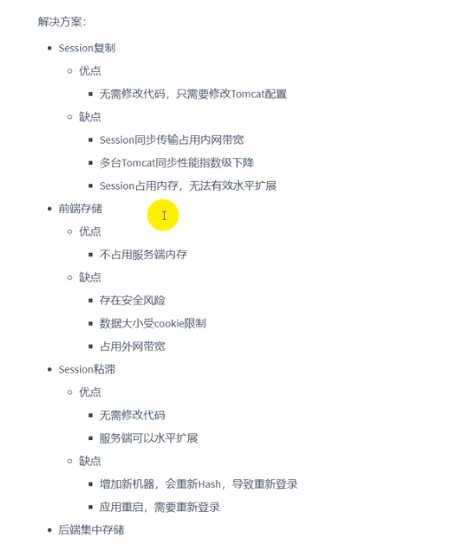
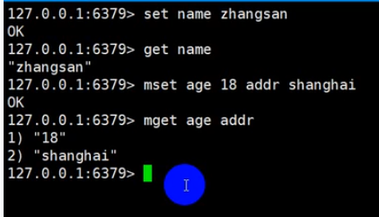
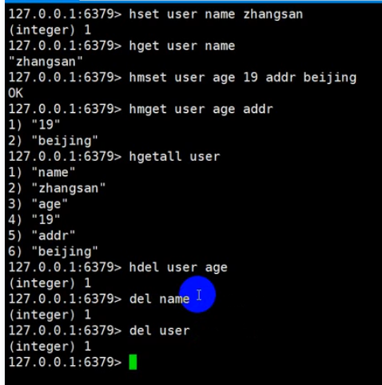
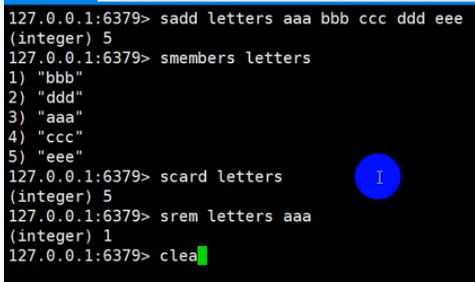

## 简介

## app制作流程
- 007功能开发前期准备工作
   - setting -> pluggin 加lombok插件
   - 启动SeckillApplication.java看是否到started启动成功，再通过网页http://localhost:8080/login/toLogin查看测试结果

- 008-009开发登录功能
   - 可以使用md5生成的密码来验证，使用mysql先赋值md5生成的密码来验证

- 010自定义注解做登录信息的拦截验证
- 011异常处理，将异常往前端抛出应答信息窗口
- 012完善登录功能：做一个是否登录成功，没有登录不能秒杀，登录成功就给一个状态可以进行秒杀

- 013分布式Session问题
  - 我们采用redis
  - 




- 014-015 redis操作

  - redis指令

    - string类型

      - 

    - Rkey-Hkey-Hvalue

      - 

    - list

      - 

    - set

      - 

    - sort set

      - 

    - 分布式锁

      - 

      - 

  - 安装redis的桌面应用程序

    - ```
      sudo snap install redis-desktop-manager
      ```

- 016 spring session 实现分布式sesion

  - 添加yaml有关redis配置，添加依赖，正常登录，打开redis-desktop-manager就可以见到数据

- 017 去掉session使用redis存储用户信息

  - 做去掉session的优化
  - 必须要启动redis
