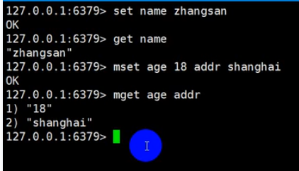
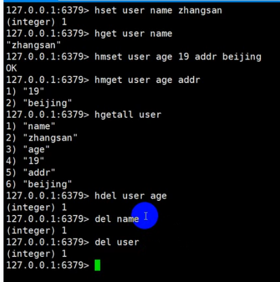

## 简介

## app制作流程
- 007功能开发前期准备工作
   - setting -> pluggin 加lombok插件
   - 启动SeckillApplication.java看是否到started启动成功，再通过网页http://localhost:8080/login/toLogin查看测试结果

- 008-009开发登录功能
   - 可以使用md5生成的密码来验证，使用mysql先赋值md5生成的密码来验证

- 010自定义注解做登录信息的拦截验证
- 011异常处理，将异常往前端抛出应答信息窗口
- 012完善登录功能：做一个是否登录成功，没有登录不能秒杀，登录成功就给一个状态可以进行秒杀

- 013分布式Session问题
  - 我们采用redis
  - 


- 014-015 redis操作

  - redis指令

    - string类型

      - 

    - Rkey-Hkey-Hvalue

      - 

    - list

      - 

    - set

      - 

    - sort set

      - 

    - 分布式锁

      - 

      - 

  - 安装redis的桌面应用程序

    - ```
      sudo snap install redis-desktop-manager
      ```

- 016 spring session 实现分布式sesion

  - 添加yaml有关redis配置，添加依赖，正常登录，打开redis-desktop-manager就可以见到数据

- 017 去掉session使用redis存储用户信息

  - 做去掉session的优化
  - 必须要启动redis
  
- 018 优化登录功能
  - 添加web组建
  
- 019 分布式会话总结

  - https://www.bilibili.com/video/BV1sf4y1L7KE?p=20

---

- 020-021 创建商品表和订单表
  - 前期开发登录页面
  - 目前开发商品列表页面，商品的详情页面(进行相应秒杀)，商品的订单页面
    - 表：**商品表，订单表（必须）**
    - 表：**秒杀商品表（数据的方便）**（秒杀或者优惠活动等等很多，不好控制，所以单独创建秒杀表，汇合商品的主键id进行外界的关联，所以有一个**秒杀订单表**）
    - 一共有四个表：商品表，订单表，秒杀商品表，秒杀订单表
- 022 实现商品列表页
  - 主要有三个页面：第一个商品的列表页->第二页商品的详情页（详情页里面有秒杀)->第三页直接生成订单页（可以有第三方支付）
  - 表的逆向生成代码，再拷贝到本工程下面(调一下错误)
- 023-024 实现商品详情页/秒杀倒计时处理
- 025 秒杀按钮处理
- 026-027 秒杀功能实现和总结
- 028-036 JMeter的压测
- 037 页面缓存（在于缓存粒度）（本章采用redis做缓存）
  - 频繁调用的不怎么变更的数据
  - 缓存有几种（区别在于粒度）：页面缓存（数据量大，放在redis做缓存），url缓存，对象缓存
  - 页面的静态化，前后端分离
    - 动态数据才真正的从后端发给前端
